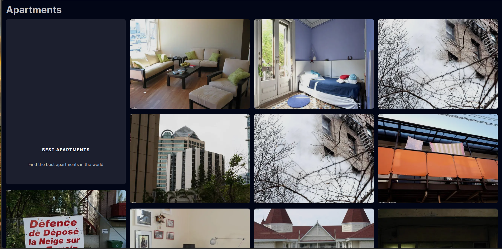
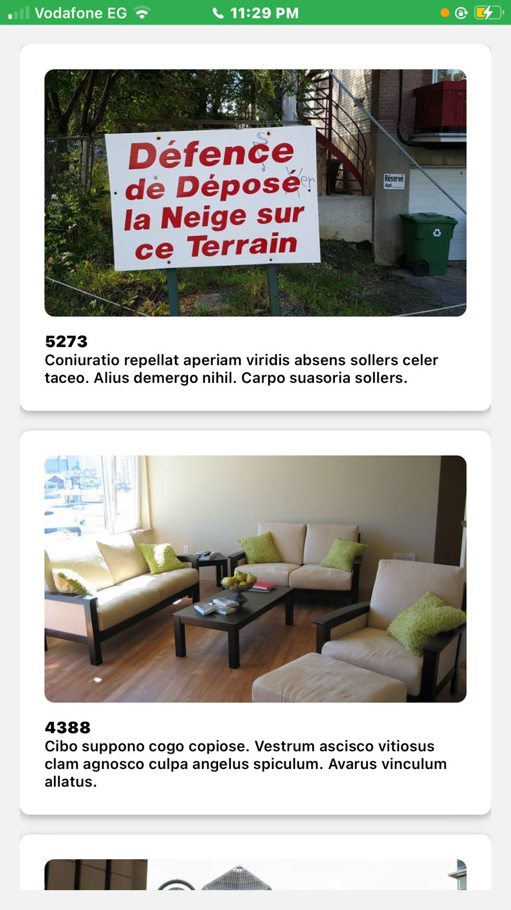
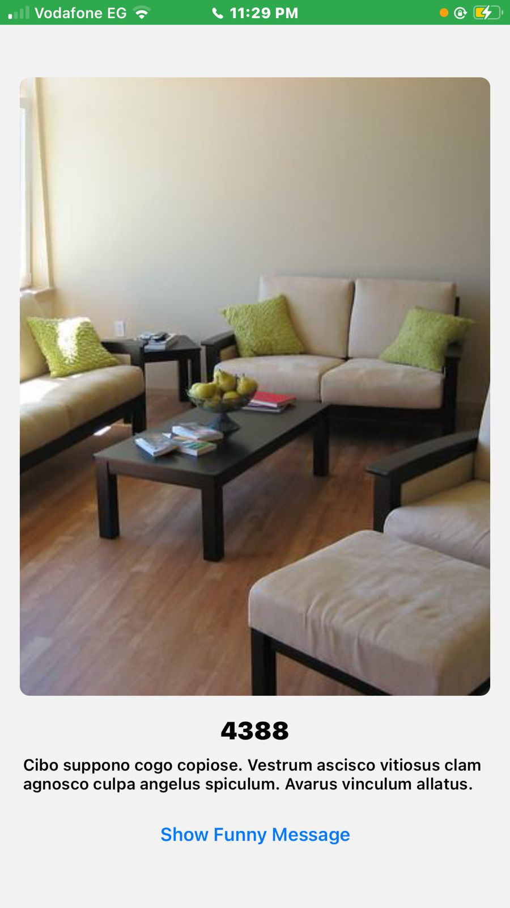

# Simple Apartment Listing App

Welcome to the Simple Apartment Listing App!
This repository contains the backend, frontend, and mobile application components of My Application.

## Backend (NestJS)

### Description

The backend of My Application is built using NestJS, a progressive Node.js framework. It provides three API endpoints to perform various actions.

### API Endpoints

1. `GET /apartments`: Retrieves a list of apartments.
2. `POST /apartments`: Creates a new apartment.
3. `GET /apartments/:id`: Retrieves a specific apartments by ID.

### Setup

1. Clone the repository.
2. Navigate to the `backend` directory.
3. Install dependencies: `npm install`.
4. Run the server: `npm run start`.

## Frontend (NextJS)

### Description

The frontend of My Application is built using Nextjs, a React Framework.

### Setup

1. Clone the repository.
2. Navigate to the `frontend` directory.
3. Install dependencies: `npm install`.
4. Add .env.local file 
5. Run the server: `npm run start`.

## Mobile Application (React Native)

### Description

The mobile application of My Application is built using React Native, a framework for building native applications using React.

### Setup

1. Clone the repository.
2. Navigate to the `mobile` directory.
3. Install dependencies: `npm install`.
4. Run the application: `npx react-native run-android` (for Android) or `npx react-native run-ios` (for iOS).

## Screenshots
### Web APP 

### Mobile

### Additional Notes

- Make sure to update the API endpoints in the frontend and mobile application to point to the correct backend URL.
